# MYCUTE OS


# ⚫︎ For Mac

## インストール
1. [リリースページ](https://github.com/mycute-os/mycute/releases) から `*_aarch64.dmg` をダウンロード
2. ダウンロードした `*_aarch64.dmg` を実行
3. ガイドに従ってインストール

## 設定
0. 一度起動して各種許可

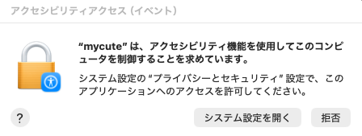

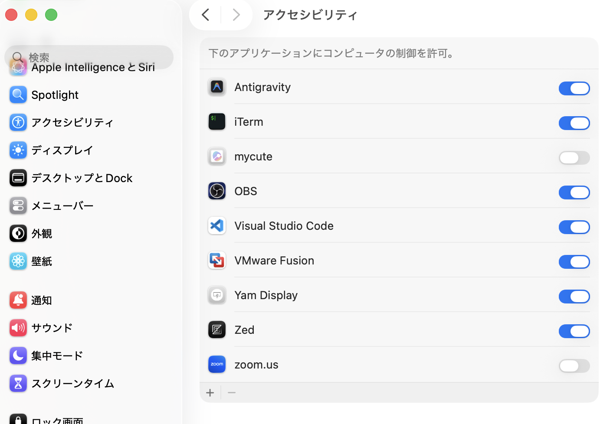

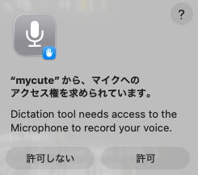

1. `~/.mycute/settings.json` を開く

2. `settings.json` の `llms` に、OpenAIのAPIキーを設定する

```json
{
  "llms": [
    {
      "name": "dummy",
      "base_url": "https://api.openai.com/v1",
      "api_key": "<ここにあなたのOpenAIのAPIキーを入力>",
      "model": "gpt‑4.1‑nano"
    }
  ],
}
```

3. MYCUTEを再起動

# ⚫︎ For Windows

## インストール
1. [リリースページ](https://github.com/mycute-os/mycute/releases) から `*_x64-setup.exe` をダウンロード
2. ダウンロードした `*_x64-setup.exe` を実行
3. ガイドに従ってインストール

## 設定
0. 一度起動して閉じる

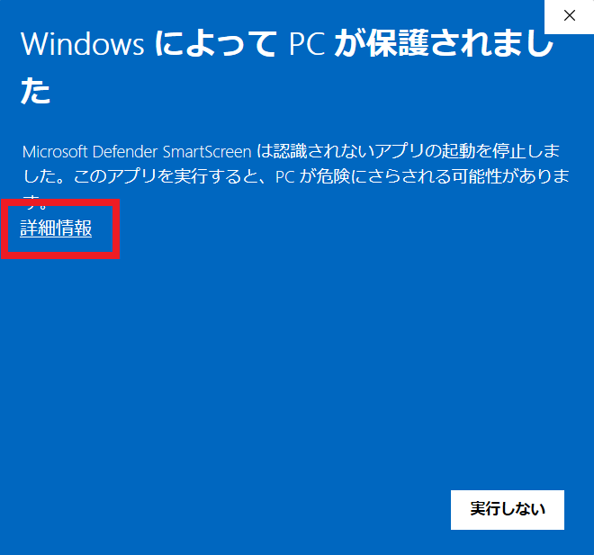

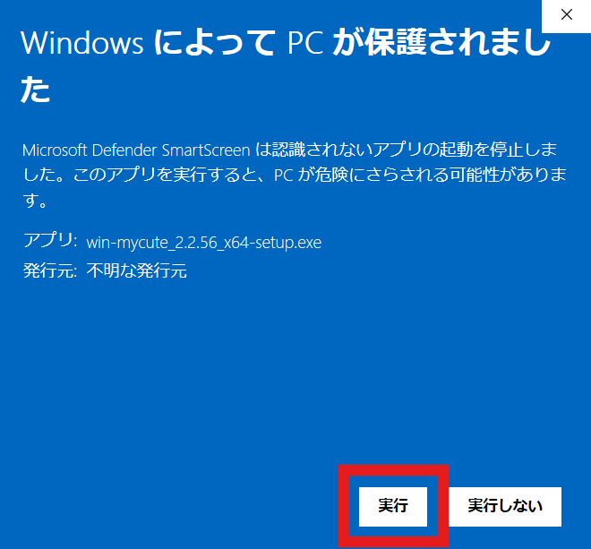

1. Wiindows 11 にて 「設定」→「時刻と言語」→「言語と地域」

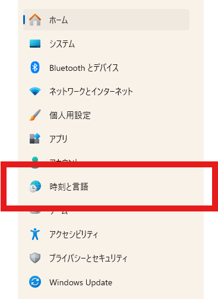

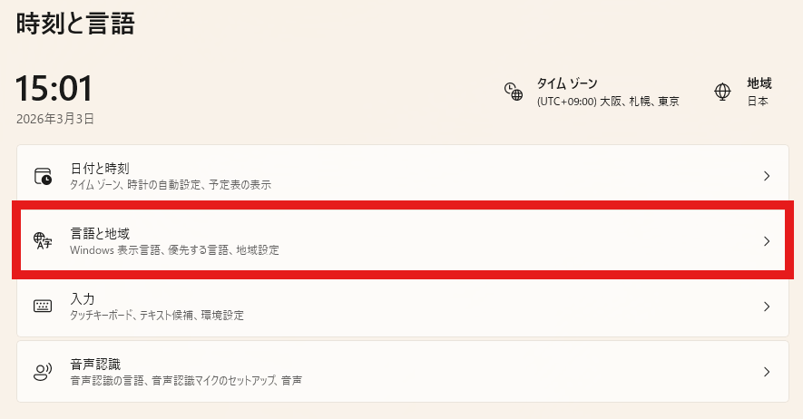

2. 「日本語」の「・・・」から「言語オプション」をクリック

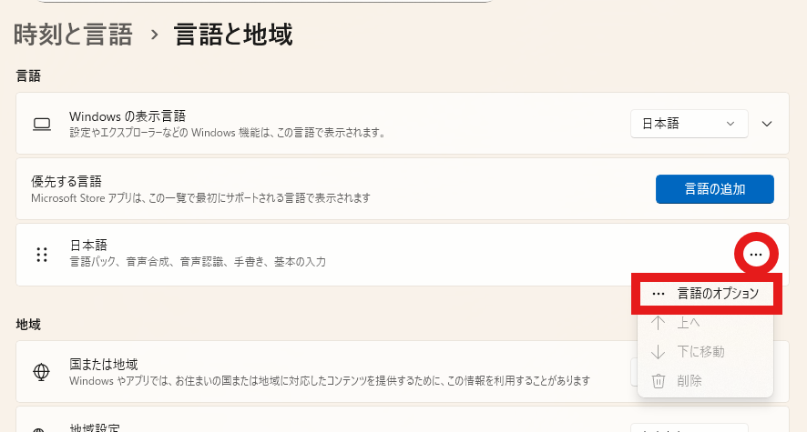

3. 「音声認識」→ 「基本的な音声認識」「強化された音声認識」をインストール

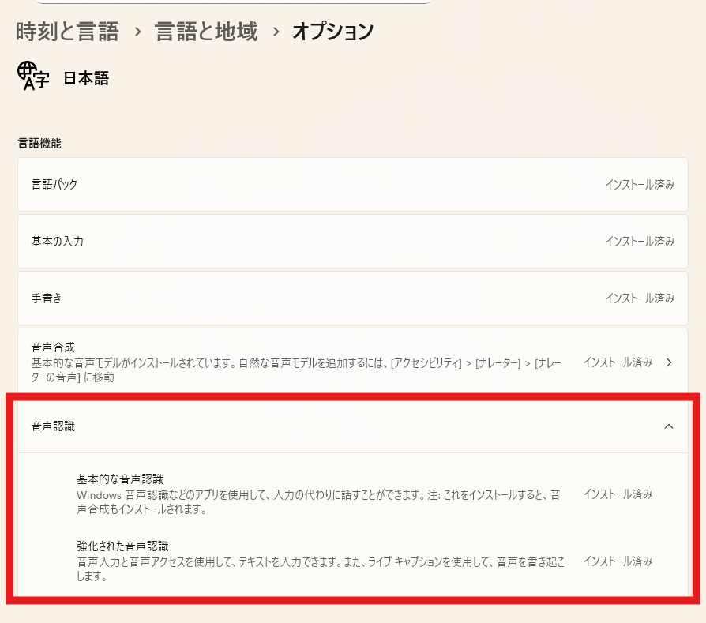

4. 音声認識許可をする

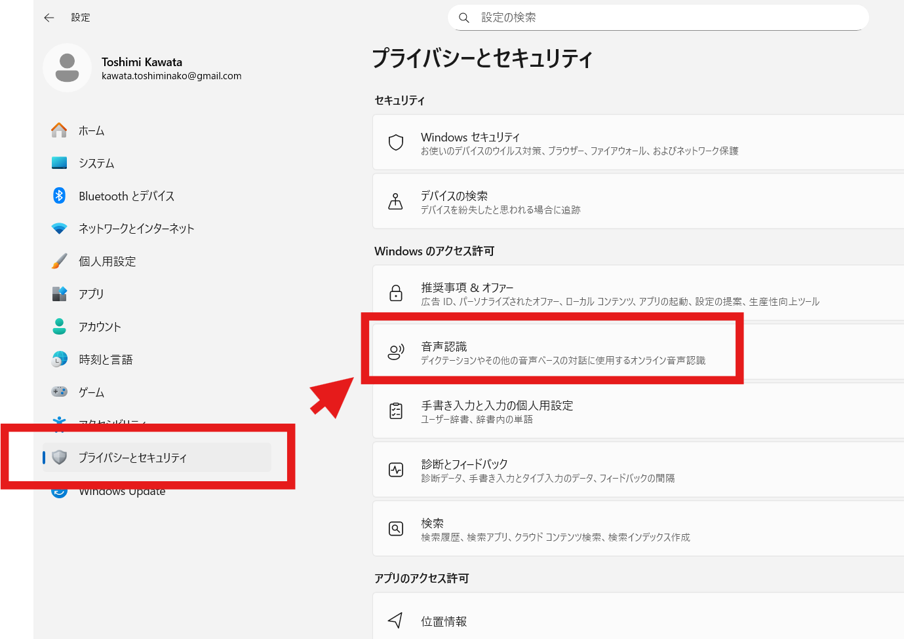

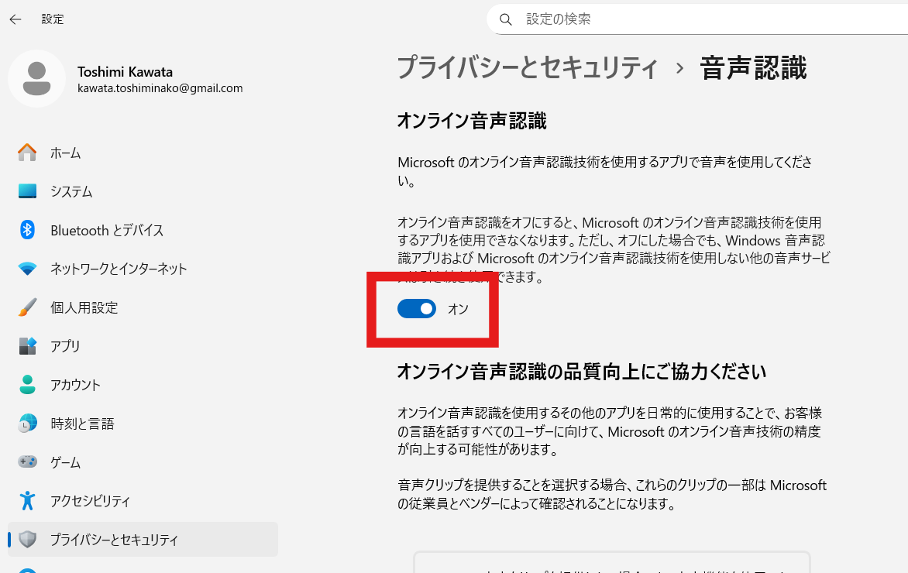

5. 「C:\Users\\<ユーザー名>\\.mycute」の中の `settings.json` を開く

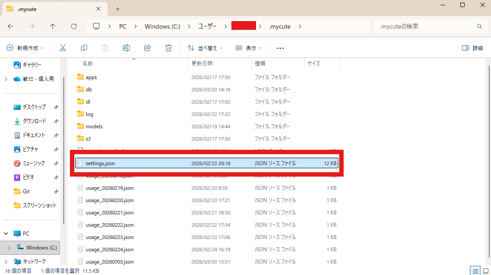

6. `settings.json` の `llms` に、OpenAIのAPIキーを設定する

```json
{
  "llms": [
    {
      "name": "dummy",
      "base_url": "https://api.openai.com/v1",
      "api_key": "<ここにあなたのOpenAIのAPIキーを入力>",
      "model": "gpt‑4.1‑nano"
    }
  ],
}
```

6. MYCUTEを再起動