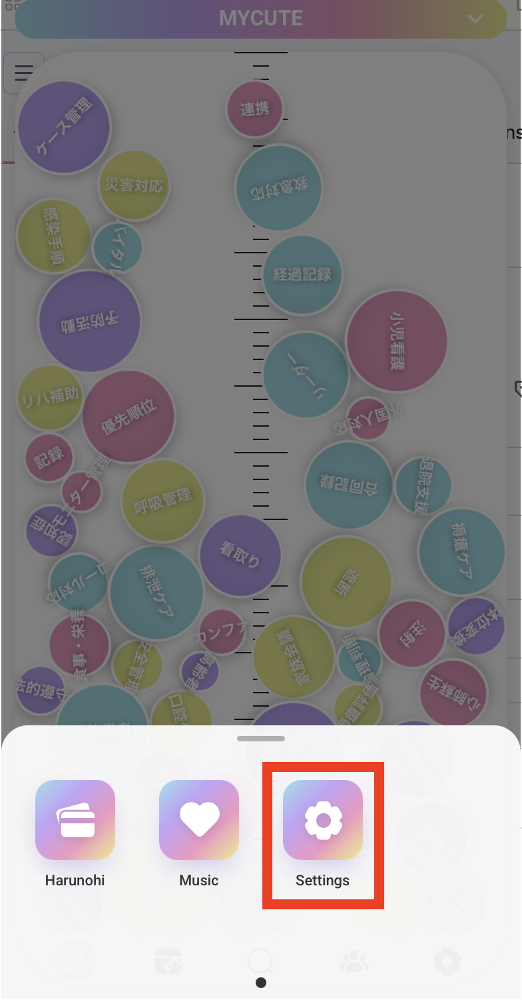
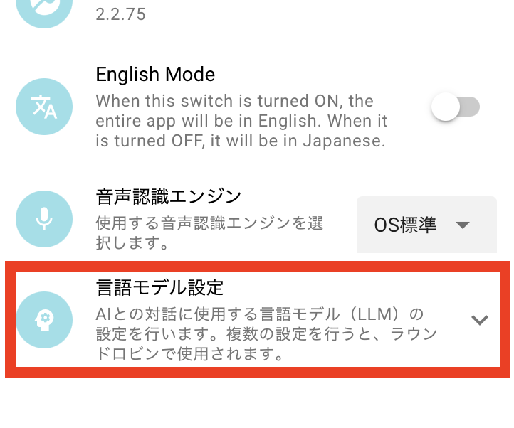

# MYCUTE OS

# ⚫︎ For Mac

## インストール
1. [リリースページ](https://github.com/mycute-os/mycute/releases) から `*_aarch64.dmg` をダウンロード
2. ダウンロードした `*_aarch64.dmg` を実行
3. ガイドに従ってインストール

## 設定
0. 一度起動して各種許可

1. `Settings` アプリを開く

2. 言語モデルエンドポイントを設定する

| 項目 | 説明 |
|---|---|
| 表示名 | 任意の識別名（ `dummy` という文字を含まないよう設定） |
| ベースURL | 言語モデルベースエンドポイントURL（特段の理由がない限り `https://api.openai.com/v1` から変える必要はない） |
| APIキー | APIキー（設定必須） |
| モデル名 | モデル名（特段の理由がない限り `gpt‑4.1‑nano` から変える必要はない） |

3. MYCUTEを再起動

# ⚫︎ For Windows

## インストール
1. [リリースページ](https://github.com/mycute-os/mycute/releases) から `*_x64-setup.exe` をダウンロード
2. ダウンロードした `*_x64-setup.exe` を実行
3. ガイドに従ってインストール

## 設定
0. 一度起動して閉じる

1. Wiindows 11 にて 「設定」→「時刻と言語」→「言語と地域」

2. 「日本語」の「・・・」から「言語オプション」をクリック

3. 「音声認識」→ 「基本的な音声認識」「強化された音声認識」をインストール

4. 音声認識許可をする

5. `Settings` アプリを開く

6. 言語モデルエンドポイントを設定する

| 項目 | 説明 |
|---|---|
| 表示名 | 任意の識別名（ `dummy` という文字を含まないよう設定） |
| ベースURL | 言語モデルベースエンドポイントURL（特段の理由がない限り `https://api.openai.com/v1` から変える必要はない） |
| APIキー | APIキー（設定必須） |
| モデル名 | モデル名（特段の理由がない限り `gpt‑4.1‑nano` から変える必要はない） |

6. MYCUTEを再起動